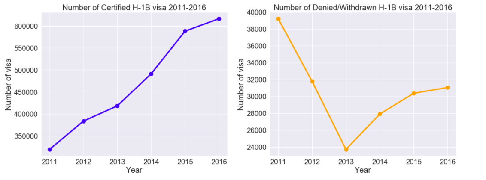
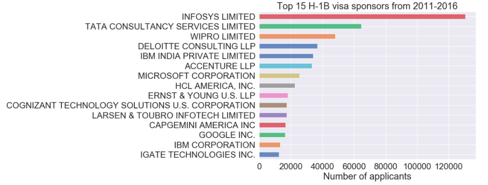
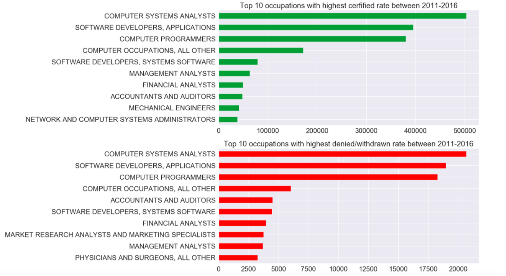
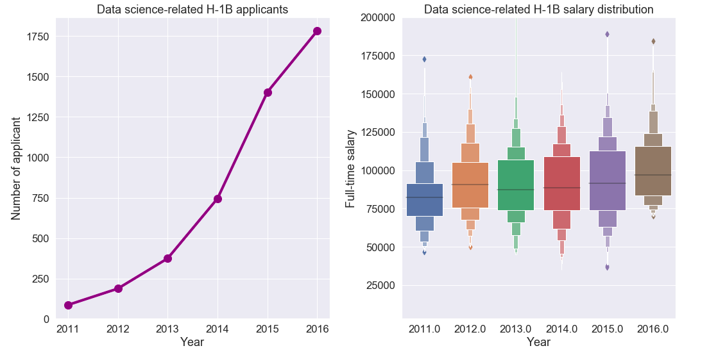
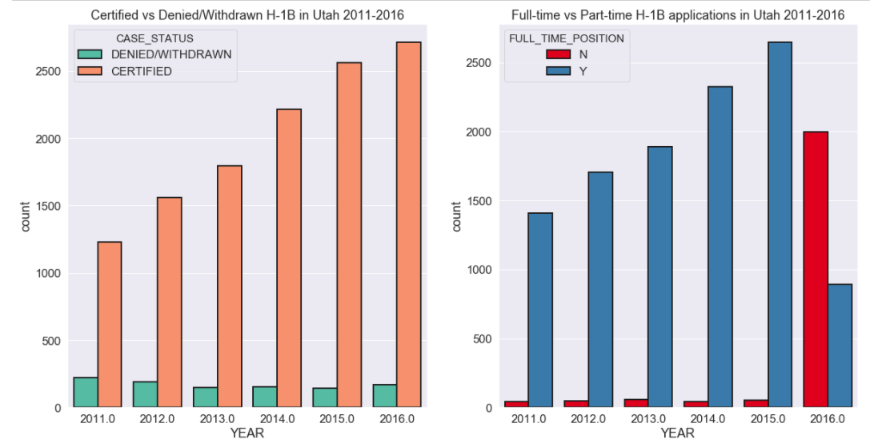

## H-1B Visa petitions Analytic report & Research proposal

H-1B visas are a category of employment-based, non-immigrant visas for temporary foreign workers in the United States. 
For a foreign national to apply for H1-B visa, a US employer must offer them a job and submit a petition for a H-1B visa to the US immigration department. 
This is also the most common visa status applied for and held by international students once they complete college or higher education 
and begin working in a full-time position.

Throughout this report, we'll use a variety of data techniques (data extraction, data cleaning, data imputation, statistical analysis, and variable exploration) 
to ask analytic question and use compelling visualizations to answer those questions. At the end og the report, we'll propose further research 
on how to expand the project further.

### About the dataset
This dataset was collected from Kaggle, and contains five year's worth of H-1B petition data (2011-2016), with approximately 3 million records overall. 
The dataset was originally collected and stored by The Office of Foreign Labor Certification (OFLC) and is updated annually. 
The dataset includes features such as case status, employer name, job title, year, worksite, etc.

### Major findings
Below are some of the findings on the H-1B visa dataset as we performed exploratory data analysis:

* The plots above show the number of Certified H-1B visa vs the number of Denied/Withdrawn H-1B visa from 2011-2016. 
It is clear that the number of approved applications increased remarkably over the year, while the number of denied applications fluctuated, 
with a big dip in 2013, but then gradually went up.

* The barchart above shows the top 15 H-1B visa sponsor in the U.S. from 2011-2016. 
Most of employers operate in the Technology, Consulting or Financial industry. 

* The 2 horizontal barcharts above display the top 10 occupations with the highest number of certified visa as well as the top 10 occupations with the highest denied/withdrawn visa between 2011-2016. 
Not surprisingly, most of the occupations with the highest number of approved H-1B visas are also the occupations with the highest denial H-1b rate.

* Looking at the market for data scientist in particular, as indicated from the 2 plots above, the number of data H-1B applicants with science-related jobs 
increased significantly from year to year, especially from 2014 to 2015. 
The median salary for H-1B applicants with science-related jobs also increased slowly from 2011-2016, as shown in the boxplot.

* Looking at the state of Utah in particular, The 2 barplots above show tht while the number of approved H-1B visa increased gradually from 2011-2016 in Utah, 
the number of denied/withdrawn applications stayed quite stable. Most of the time, employers sponsored full-time international workers. 
However, in 2016, we see a reversed trend, where companies sponsored almost double not-full-time employees than full-time employees.

### Research proposal
* Scrape and collect 2017-2019 H-1B petition data in order to expand the current dataset for further researching
* Build machine learning model to predict H-1B visa status based on multiple variables (Occupation code, Employer name, City, State, Salary)
